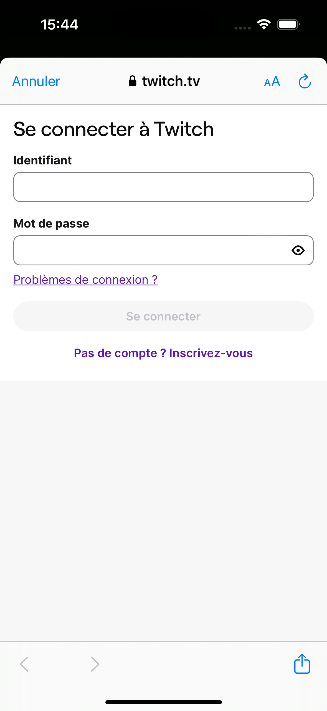
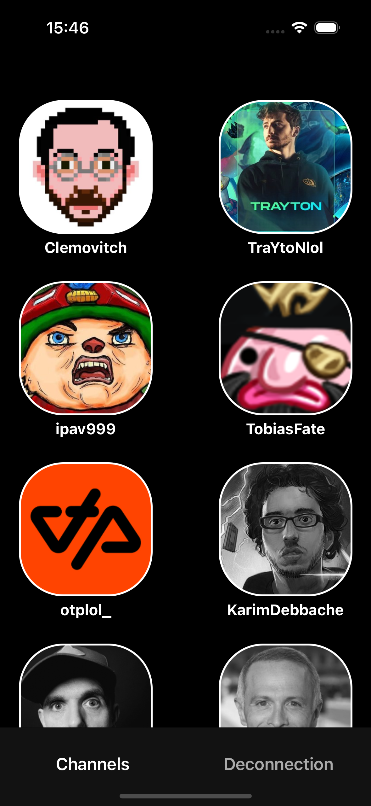
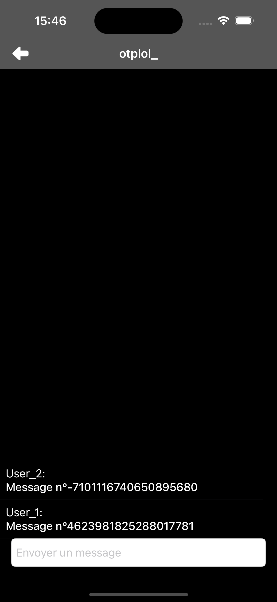
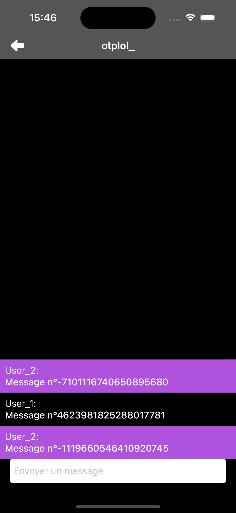
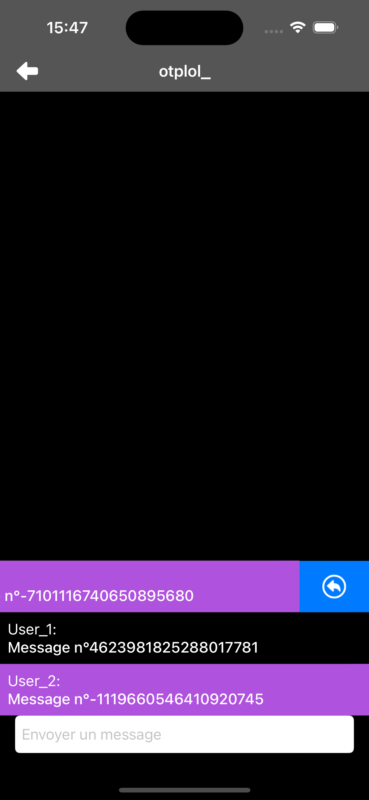
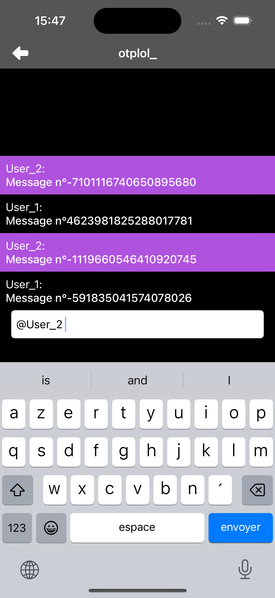

# Twitch_Chat 💬🎮
A Fullscreen Chat App
  
**Twitch_Chat** is an iOS application that provides a fullscreen, real-time chat experience for Twitch.  
The focus of this project is on **clean architecture** and **robust authentication handling** — showcasing how to build a scalable, secure iOS app.

## 📱 Features
- 🔑 **OAuth 2.0 Authentication** with Twitch
- 📦 **Token lifecycle management**:
  - Secure storage of access & refresh tokens
  - Automatic refresh before expiration
  - Revocation on logout (server + local cleanup)
- 💬 **Fullscreen chat view** with live IRC messages
- 📡 **Twitch IRC connection** via `NWConnection` (`Network.framework`)
- ✨ **Chat interactions**:
  - 👆 Double tap a user to highlight them
  - 👉 Swipe left on a message to reply (`respondTo`)
- 👤 **Followed channels list** including:
  - Streamer profile picture (async image loading)
  - Live / offline status
- 🎨 **Custom design**:
  - Launch screen
  - Twitch-inspired app icon

## 🧩 App Structure
### 🗂 Dependency Management
- **AppDependencyContainer**: centralizes and injects dependencies to keep code modular, testable, and decoupled.

### 🌍 Networking Layer
- **RequestBuilder**: fluent API to build `URLRequest` with methods, headers, and body.
- **NetworkClient**: generic HTTP client with:
  - Status code validation
  - JSON decoding with `convertFromSnakeCase`
  - Graceful handling of empty responses via `EmptyResponse
```
if data.isEmpty {
    if T.self == EmptyResponse.self {
        return EmptyResponse() as! T
    } else {
        throw NetworkError.decoding(NSError(domain: "EmptyData", code: -1))
    }
}
```
## 🔑 Authentication Layer
- **TokenStorage**: persist tokens securely across sessions.
- **TokenManager**: manages token lifecycle:
  - Automatically refreshes when expired
  - Ensures API calls always have a valid token
  - Revokes on logout and clears local data

## 🔐 Secrets Management
- API keys & client IDs are stored in `Secrets.xcconfig`
- File is excluded from Git (`.gitignore`)
- Example configuration provided in `Secrets.example.xcconfig`

## 🚀 Getting Started
### 1. Clone the Repository
```bash
git clone https://github.com/yourUsername/Twitch_Chat.git
```
### 2. Register a New Application on Twitch Developer Console
1. Make sure you have a Twitch account (or create one).
2. Go to [https://dev.twitch.tv](https://dev.twitch.tv) and log in.
4. In your console, click **“Register Your Application”**.
5. Fill the form:
   - **Name** → choose anything you like (e.g. `Twitch_Chat`).
   - **OAuth Redirect URL** → see below ⬇️
   - **Category** → `Application Integration`.
   - **Client type** → `Confidential`.

### 🔗 How to Build an OAuth Redirect URL
Twitch requires a **publicly accessible HTTPS endpoint** for redirect.  
The simplest way is to use **GitHub Pages**:
1. Create a new **public GitHub repository** (e.g. `chat-oauth-redirect`).
2. Add a file called `index.html` at the root with the following content:
```html
   <!DOCTYPE html>
<html>
<head>
  <title>OAuth Redirect</title>
</head>
<body>
  <script type="text/javascript">
    const params = new URLSearchParams(window.location.search);
    const authCode = params.get('code');
    if (authCode) {
        window.location.href = `chat://oauth/callback?code=${authCode}`;
    } else {
        console.error('No authorization code found in the URL');
    }
  </script>
</body>
</html>
```
3. Go to your repository → **Settings** → **Pages**.
4. In **Source**, select the `main` branch and save.
5. GitHub will generate a page after a few seconds.
👉 Your final Redirect URL will look like:
```
https://YOUR_ACCOUNT_NAME.github.io/YOUR_REPOSITORY_NAME/
```
6. Once registered, Twitch will give you a **Client ID** and you can generate a **Client Secret**.
### 3. Configure Secrets
Duplicate the file `Secrets.example.xcconfig` and rename it to `Secrets.xcconfig`  
Add your credentials in this format:
```
CLIENT_ID = your_client_ID
CLIENT_SECRET = your_client_secret
REDIRECT_URL = your_redirect_URL
```
⚠️ Note for Xcode:  
When storing an URL inside .xcconfig, write it as:
```bash
https:/$()/your_URL/
```
Without this, Xcode may fail to interpret the //.  
➡️ Ensure Secrets.xcconfig is excluded from version control via .gitignore.
### 4. Run the Project
Open `Twitch_Chat.xcodeproj` in Xcode and build ✅

## 📦 Technologies
- Swift + UIKit
- **Network.framework** for Twitch IRC
- **URLSession (async/await)** for REST API calls
- **xcconfig** for secrets & configuration
- **Dependency Injection** via AppDependencyContainer
- **Token lifecycle management** (storage + refresh + revoke)
  
## 📸 Screenshots
<table>
  <tr>
    <th colspan="3">Connexion</th>
  </tr>
  <tr>
    <td></td>
    <td></td>
    <td></td>
  </tr>
</table>

<table>
  <tr>
    <th colspan="2">Navigation</th>
  </tr>
  <tr>
    <td></td>
    <td></td>
  </tr>
</table>

| Chat messages | Double tap to hightlight a user | Swipe to the left to respond to someone | Writing in the chat |
|---------------|----------------------------------|-------------------|---------------------|
|  |  |  |  |

## 📚 Notes
This project emphasizes **architecture and authentication robustness** over UI complexity.
It demonstrates:
- How to build a modular iOS app with dependency injection
- How to safely handle OAuth tokens across their full lifecycle
- How to mix high-level REST APIs with low-level IRC networking

## 👤 About Me
I’m Nicolas Schena, an iOS developer passionate about building secure, scalable, and maintainable applications.
This project reflects my skills in architecture design, secure API integration, and real-time networking.
- [LinkedIn](https://www.linkedin.com/in/nicolas-schena-413056155/)
- [Other Projects](https://github.com/SchenaNicolas-Pro)
